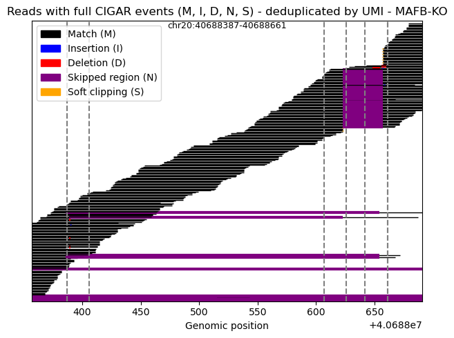

<table>
  <tr>
    <td width="320" align="center">
      
    </td>
    <td>
      <h1>🧬 CIGAR-bIA</h1>
      <b>CIGAR-based Indels Analysis</b>
      <br><br>
      CIGAR-bIA is a Python toolkit for analyzing genomic editing events based on CIGAR strings extracted from BAM files.  
      It provides functions to identify, quantify, and visualize insertions and deletions across specific genomic regions.
    </td>
  </tr>
</table>

---

## ⚙️ Installation

### 🔹 From terminal
```bash
git clone https://github.com/francescopatane96/CIGAR-bIA.git
cd CIGAR-bIA
pip install .
```

### 🔹 From Jupyter Notebook
```python
!git clone https://github.com/francescopatane96/CIGAR-bIA.git
!pip install CIGAR-bIA/.
```

---

## 💻 Example Usage

### 1️⃣ Import the main modules
```python
import cigar_bia.events as cba
import cigar_bia.plotting as cbp
```

### 2️⃣ Analyze indel events from CIGAR strings
```python
events = cba.analyze_editing_events(
    bam_file="/data/possorted_genome_bam.bam", # be sure your .bam.bai file is in the same location of .bam file
    chrom="chr20",
    start=40688387,
    end=40688661,
    meta_file="/results/meta_mafb_KO.csv",
    status_col= "Condition",
    status="MAFB-KO"
)
```

the metadata file (meta_file) could be easily obtained direcly from the seurat object via:
```R
meta <- seurat_obj@meta.data
meta$barcode <- rownames(meta)
write.csv(meta, "/results/meta_file.csv", row.names = FALSE)
```

### 3️⃣ Visualize the results
```python
cbp.plot_cigar_reads(events_ko, chrom="chr20", legend=True, start=40688387, end=40688661, extra_positions=[40688406,
                                                                                           40688607, 40688626,
                                                                                           40688642])
```

<p align="center">
  
</p>


### 4. Calculate KO efficiency

```python
cbp.plot_editing_distribution(events_ko, chrom="chr20", start=40688626, end=40688661, status="MAFB-KO")
```
---

## 📄 License
This project is released under the **MIT License**.  
See the [LICENSE](./LICENSE) file for more details.

---

## 🤝 Contributing
Contributions, bug reports, and feature suggestions are welcome!  
Please open a **pull request** or submit a **GitHub issue** on the project page.

---

📘 *Author:* [Francesco Patanè](https://github.com/francescopatane96)
